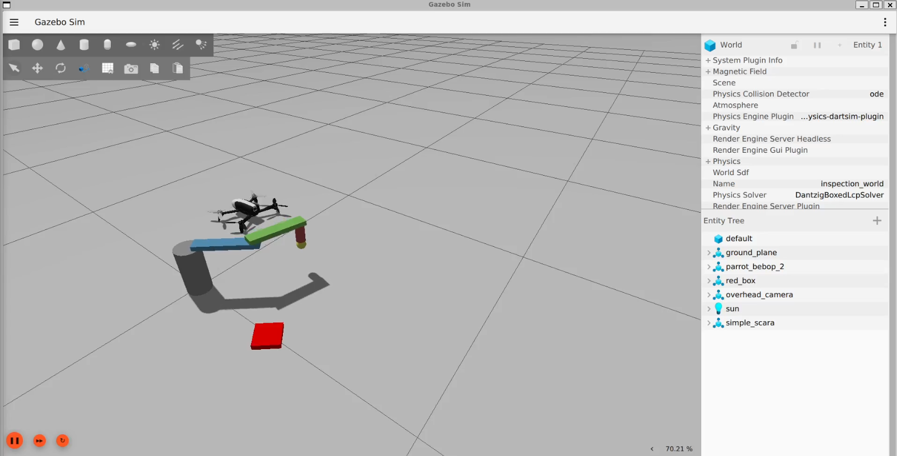
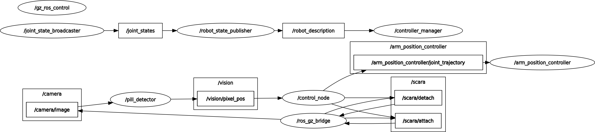
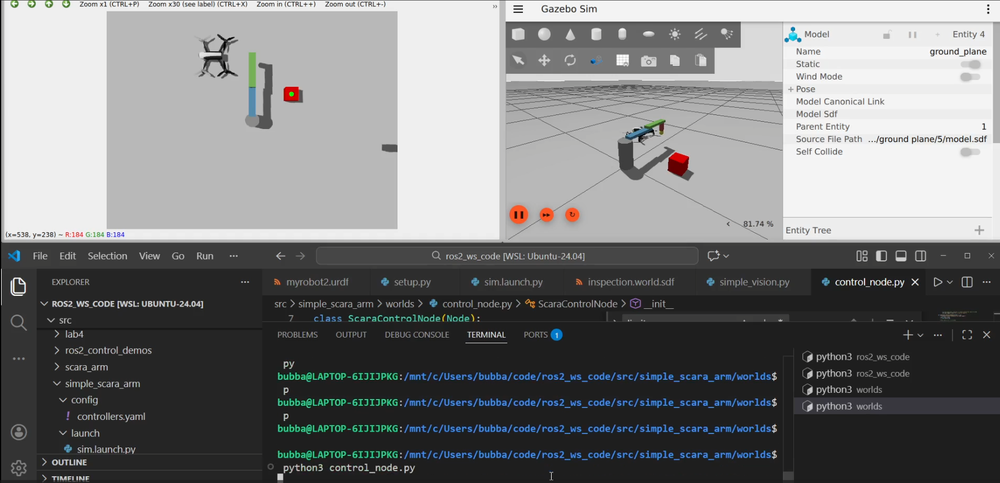

# Automated SCARA Pill-Sorting Pipeline




### Course: MAI5303: Applied Robotics
**Environment:** WSL2 | ROS 2 Jazzy Jalisco | Gazebo Harmonic


## 📌 Project Overview
In biomedical laboratory environments, handling pharmaceutical samples requires extreme precision to avoid contamination. This project simulates an automated **Pill Handling & Inspection** station. 

The system utilizes a **SCARA (Selective Compliance Assembly Robot Arm)** to:
1.  **Detect:** Identify red pill samples on a workspace using Computer Vision.
2.  **Discriminate:** Calculate if a pill meets the "red enough" threshold.
3.  **Sort:** Calculate Inverse Kinematics (IK) to reach the sample and sort it into "Accept" or "Reject" containers.


---

## 🛠 Methodology
The development followed an incremental, **bottom-up approach**, focusing on "Separation of Concerns" to ensure each module worked in isolation before full-system integration.

### Development Steps:
* **Modeling:** Designed the 3-DOF SCARA in URDF/Xacro using VS Code for real-time visualization.
* **Control:** Integrated `ros2_control` by reverse-engineering hardware simulation examples.
* **Perception:** Developed an OpenCV node for live camera feed processing and coordinate mapping.
* **Unit Testing:** Used "Isolation Testing" (an MVP world with simple cubes) to debug the `DetachableJoint` plugin before moving to the final lab environment.



---

## 🏗 System Architecture
The architecture leverages a modular node-based design to separate perception, logic, and hardware control:

* **Perception Node:** Uses OpenCV to identify target centroids and publishes world coordinates.
* **Control Node:** Handles task sequencing, Inverse Kinematics (IK), and gripper logic.
* **ROS 2 Bridge:** Facilitates communication between ROS 2 and Gazebo (Clock, Camera images, and Attachment services).
* **ros2_control:** Manages joint trajectory execution via a PID-tuned controller.



---

## 📐 Control & Task Logic

### 1. Coordinate Transformation
The vision system maps camera pixels $(u, v)$ to world coordinates $(x, y)$ using calibrated scale factors to resolve axis mirroring:
$$x_{world} = (v_{pixel} - v_{center}) \times scale_{x}$$
$$y_{world} = (u_{pixel} - u_{center}) \times scale_{y}$$

### 2. Inverse Kinematics (IK)
To reach the calculated targets, the robot solves for joint angles $\theta_1$ and $\theta_2$ based on the Law of Cosines:
$$\cos(\theta_2) = \frac{x^2 + y^2 - L_1^2 - L_2^2}{2 L_1 L_2}$$


### 3. The "Catch and Release" Sequence
We implemented a **"No-Contact" rule** to ensure stability. The arm descends to a pre-defined height leaving a 2mm-5mm gap. An `EntityFactory` message is then published to the Gazebo `DetachableJoint` plugin to dynamically "weld" the pill to the arm.

---

## ⚠️ Challenges & Limitations
* **Controller Dynamics:** Initial joints lacked the strength to overcome gravity. This required custom PID tuning in the `joint_controller.yaml`.
* **Software Sync:** Running Gazebo alone failed to load necessary plugins; a comprehensive ROS 2 launch file was developed to ensure correct initialization order.
* **Gripper Reliability:** Standard magnet plugins were unsupported in Gazebo Harmonic, requiring a pivot to the `DetachableJoint` system via significant reverse-engineering.

---

## 🚀 Installation & Usage

### 1. Clone & Build
```bash
mkdir -p ~/scara_ws/src
cd ~/scara_ws/src
git clone <your-repo-link>
cd ..
colcon build --symlink-install
source install/setup.bash
```

### 2. Launch Simulation
Bash
ros2 launch scara_arm main_launch.py

🔮 Future Improvements
Dynamic Object Locator: Implement a listener to handle multiple pills dynamically based on proximity.

Obstacle Avoidance: Integrate MoveIt 2 for collision-aware trajectory planning in cluttered lab environments.

📚 References
ROS 2 Control: Hardware Simulation Examples

Gazebo Harmonic: Detachable Joint Plugin Documentation

OpenCV: Color Thresholding and Blob Detection Tutorials

### 2. Video Demo


<div align="center">
  <a href="https://www.youtube.com/watch?v=sZJVe2RMx0M">
    
  </a>
  <p><i>Click above to watch the Automated SCARA Pill-Sorting Simulation in Gazebo Harmonic</i></p>
</div>

